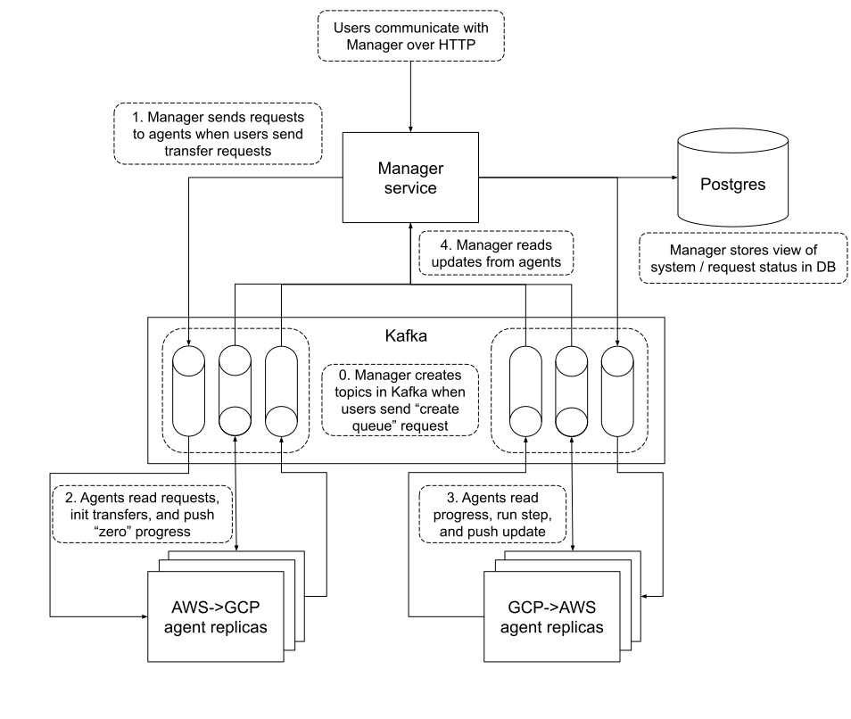

# Transporter
Bulk file-transfer system for data ingest / delivery.

## Why Transporter?
Data ingest into our cloud environment requires bulk file transfer from both on-prem storage and other clouds.
Similarly, data delivery requires uploading large files to external systems. Transporter aims to provide uniform
(but extensible) APIs for submitting, monitoring, and executing bulk transfers between these various environments.

## Components
Transporter is a distributed system of services, connected via Kafka. The main services are:
* The [Transporter "Manager"](manager/README.md), responsible for request validation, orchestration, and reporting.
* [Transporter "agents"](agents/README.md), responsible for request execution.

We intend for the Manager to be generic, and handle the orchestration of transfers between any arbitrary source
and destination systems. On the other hand, we intend for agents to be specialized to handle specific transfer needs.
We provide an abstract ["template"](agents/template/README.md) for agent programs to handle common requirements across
all transfers.

The overall system architecture is:


## Deployment
We package Transporter components into Docker images, and publish the images to
[Dockerhub](https://hub.docker.com/search?q=broadinstitute%2Ftransporter-&type=image). Images tagged by Git hash
are published on every merge to master.

It should be possible to deploy Transporter anywhere Docker can run. We deploy to GKE using infrastructure in the
[transporter-deploy](github.com/broadinstitute/transporter-deploy/README.md) repository.

## Building
Transporter is built using `sbt`. Installation instructions for `sbt` are [here](https://www.scala-sbt.org/download.html).

Once you're set up, drop into the REPL by running `sbt` from the project root. From there, you can `compile`, `test`, etc:
```bash
$ sbt
... log output ...
sbt:transporter> compile
sbt:transporter> test
```

It's also possible to run individual `sbt` commands directly from bash. This is _not_ the recommended way to use `sbt`,
as you'll eat the tool's (nontrivial) startup costs on every command.

## Developing
Two main options exist for Scala development:
  1. IntelliJ + the Scala plugin is well-established, and provides the best support for refactoring. On the negative side,
     it uses a reverse-engineered version of the scalac presentation compiler which sometimes marks valid code with errors.
  2. [Metals](https://scalameta.org/metals/) (primarily combined with VS Code) is the new hotness. It has fewer features
     than IntelliJ, but it delegates all build/compile/test to the underlying build tool so its reporting is usually more accurate.

In either tool, opening the root `transporter` directory should bring up an "import build" dialog.
